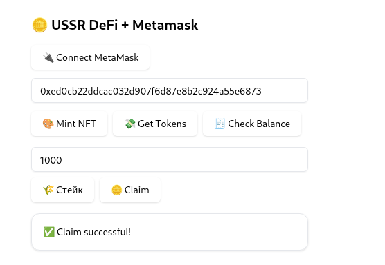

# USSR DeFi DApp

USSR — это полноценный DeFi-проект, в котором реализованы:
- Минт NFT (через MetaMask и backend)
- Stake токенов
- Claim наград
- Airdrop faucet

## Стек технологий
- Python + Flask (backend API)
- Solidity (контракты NFT и Token)
- React (frontend UI с поддержкой MetaMask)
- IPFS (хранение метаданных для NFT)
- Web3.py (взаимодействие с блокчейном)

## Установка и запуск

### Backend
```bash
cd backend
pip install -r requirements.txt
cp .env.template .env  # и заполни ALCHEMY_API_URL, PRIVATE_KEY, PUBLIC_KEY
python faucet_server_web3_staking.py
```

### Frontend
```bash
cd frontend
npm install
npm run dev
```

## Пример
- Минт через `/mint_nft`
- Stake через `/stake`
- Claim через `/claim`
- Все действия фиксируются в mint_state.json и log-файлах

## Контракты
- NFT: [ССЫЛКА НА EXPLORER]
- Token: [ССЫЛКА НА EXPLORER]

## Скриншоты





## Лицензия
MIT
